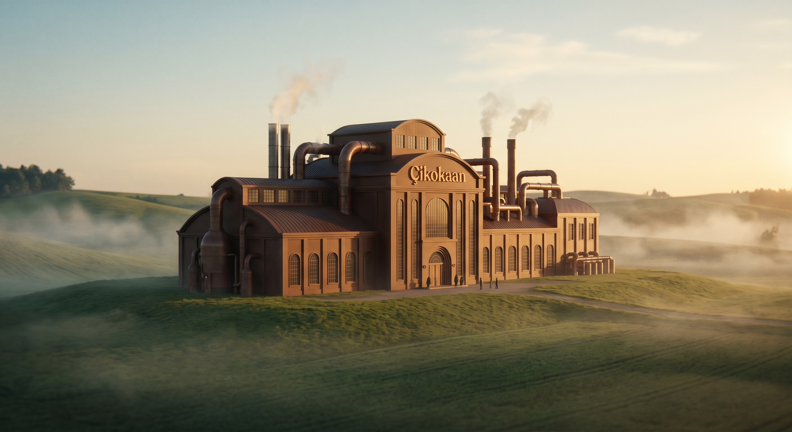

<p align="center">
  
</p>

<h1 align="center">🍫 Çikokaan — Artisan Cocoa Reserve</h1>

<p align="center">
  <strong>Sinematik scroll deneyimi ile el yapımı çikolata hikâyesi</strong><br>
  <em>A cinematic scroll-driven storytelling experience for artisan chocolate</em>
</p>

<p align="center">
  
  
  
  
</p>

---

## ✨ Proje Hakkında

**Çikokaan**, bir çikolata fabrikasının kapılarını scroll ile açan sinematik bir web deneyimidir. Kullanıcı sayfayı kaydırdıkça fabrikaya yaklaşır, içeri girer, üç küçük çikolata ustasıyla tanışır ve her birinin eşsiz lezzetini keşfeder.

> *"Her şey burada başlar..."*

Tüm geçişler scroll hızıyla senkronize video scrubbing teknolojisi ile kontrol edilir — tıpkı Apple ürün sayfalarındaki gibi.

---

## 🎬 Deneyim Akışı

```
🏭 Fabrika Uzaktan → 🎥 Yakınlaşma → 🏗️ Fabrika Yakın Plan
        ↓
🚪 Kapıya Gelme → 🎥 Kapı Açılır → 🌫️ Buğulu Giriş
        ↓
👦👧👦 Üç Küçük Usta → 🍫 Sütlü · 🖤 Bitter · 🤍 Beyaz
        ↓
✨ Sihirli Dönüşüm → 🛍️ Ürün Vitrini → 🎬 Final
```

---

## 🛠️ Teknolojiler

| Teknoloji | Kullanım |
|-----------|----------|
| **GSAP 3** + **ScrollTrigger** | Master timeline, scroll-linked animasyonlar |
| **Lenis** | Buttery smooth scroll |
| **Canvas API** | Altın parçacık sistemi |
| **Vanilla JS** | Proxy pattern video scrubbing |
| **CSS Custom Properties** | Çikolata temalı design system |

---

## 🎨 Premium Efektler

<table>
  <tr>
    <td align="center">🎞️<br><strong>Film Grain</strong><br>Canvas noise texture</td>
    <td align="center">✨<br><strong>Gold Particles</strong><br>45 floating altın parçacık</td>
    <td align="center">🔦<br><strong>Mouse Light</strong><br>Sıcak ışık takibi</td>
  </tr>
  <tr>
    <td align="center">📊<br><strong>Progress Bar</strong><br>Altın scroll göstergesi</td>
    <td align="center">✍️<br><strong>Text Split</strong><br>Kelime kelime blur reveal</td>
    <td align="center">🎨<br><strong>Color Grade</strong><br>Sinematik warm overlay</td>
  </tr>
</table>

---

## 📁 Proje Yapısı

```
çikokaan/
├── index.html              # Ana sayfa
├── css/
│   ├── index.css           # Design system & tokens
│   ├── scenes.css          # Sahne layout & bileşenler
│   ├── products.css        # Ürün kartları & panel
│   ├── effects.css         # Premium efekt stilleri
│   └── preloader.css       # Yükleme ekranı
├── js/
│   ├── main.js             # Master controller & timeline
│   ├── effects.js          # Parçacıklar, grain, mouse light
│   ├── products.js         # Ürün etkileşim mantığı
│   ├── scenes.js           # Sahne yönetimi
│   └── video-scrub.js      # Video scrub sınıfı
├── çikokaanimage/          # Sahne görselleri (14 adet)
├── çikokaanvideos/         # Geçiş videoları (git dışı)
├── compress_images.py      # Görsel sıkıştırma aracı
└── reencode_videos.py      # Video re-encode (GOP=1)
```

---

## 🚀 Kurulum & Çalıştırma

```bash
# Repoyu klonla
git clone https://github.com/Kaaanyildiz/Cikokaan.git
cd Cikokaan

# Herhangi bir statik sunucu ile çalıştır
npx serve .
# veya
python -m http.server 3000
```

> ⚠️ **Video dosyaları repo'ya dahil değildir** (GitHub boyut limiti). Videoları `çikokaanvideos/` klasörüne ayrıca eklemeniz gerekir.

### Video Hazırlama

Videolar scroll scrubbing için **her frame'de keyframe** içermelidir:

```bash
python reencode_videos.py
```

Bu script FFmpeg ile tüm videoları `GOP=1` formatında yeniden encode eder.

---

## 🎯 Teknik Detaylar

### Video Scrubbing — Proxy Pattern

GSAP doğrudan `video.currentTime`'ı tween edemez güvenilir şekilde. Bunun yerine bir proxy object kullanılır:

```javascript
const proxy = { time: 0 };
tl.fromTo(proxy, { time: 0 }, {
  time: videoDuration,
  ease: 'none',
  onUpdate: () => {
    video.currentTime = proxy.time;
  }
}, position);
```

### Metin Animasyonları — Word Split

Metin içeriği DOM walker ile kelime kelime `<span>` elementlerine ayrılır, ardından GSAP stagger ile blur → sharp geçişi uygulanır:

```javascript
// Her kelime: opacity 0 → 1, blur 6px → 0px, y 30 → 0
tl.fromTo(words, 
  { autoAlpha: 0, y: 30, filter: 'blur(6px)' },
  { autoAlpha: 1, y: 0, filter: 'blur(0px)', stagger: 0.06 }
);
```

---

## 🎭 Sahneler

| # | Sahne | Tür | Açıklama |
|---|-------|-----|----------|
| 1 | Fabrika Uzaktan | 📷 Görsel | Ken Burns zoom-out |
| 1→2 | Yakınlaşma | 🎥 Video | Fabrikaya doğru hareket |
| 2 | Fabrika Yakın | 📷 Görsel | Pan + scale efekti |
| 2→3 | Kapıya Gelme | 🎥 Video | Giriş kapısına yaklaşma |
| 3 | Açık Kapı | 📷 Görsel | *"Hoş geldin"* metni |
| 3→4 | İçeri Giriş | 🎥 Video | Buğulu geçiş |
| 4 | Üç Çocuk | 📷 Görsel | *"Üç küçük usta"* metni |
| 4→5 | Çocuk 1 | 🎥 Video | Sütlü çikolata ustası |
| 5-10 | Ürün Tanıtım | 📷 Crossfade | Info kartları ile ürünler |
| 10→11 | Geri Çekilme | 🎥 Video | Grup portreye dönüş |
| 11→13 | Sihirli Dönüşüm | 🎥 Video | Ürün vitrinine geçiş |
| 13 | Ürün Vitrini | 📷 Görsel | Glassmorphism kartlar |
| 14 | Final | 📷 Görsel | Kapanış & footer |

---

## 📱 Uyumluluk

- ✅ Chrome / Edge (önerilen)
- ✅ Firefox
- ✅ Safari
- ✅ Mobil tarayıcılar (touch scroll destekli)
- ✅ `prefers-reduced-motion` desteği

---

## 📄 Lisans

Bu proje eğitim ve portfolyo amaçlı geliştirilmiştir. Tüm görseller ve videolar projeye özeldir.

---

<p align="center">
  <strong>Est. MMXXVI • Handcrafted with passion</strong><br>
  <sub>Built with 🍫 and ☕ by <a href="https://github.com/Kaaanyildiz">Kaan Yıldız</a></sub>
</p>
